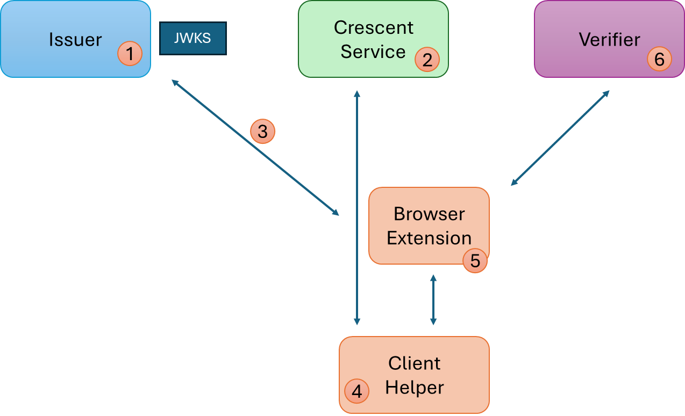
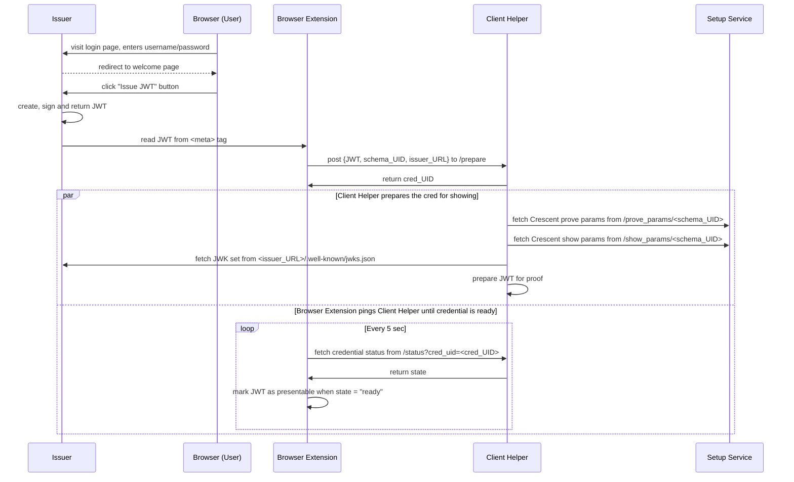
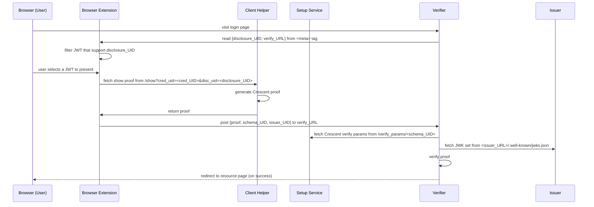

# Crescent Sample

This folder contains a sample setup service, issuer, client, and verifier making use of the Crescent system. Note that these
components are for demonstration only; they should not be used in production environments.

The sample is composed of the following components:
* Issuer: a Rocket server that issues JWT tokens; see [`issuer/README.md`](./issuer/README.md). Listens at `http://localhost:8001`.
* Setup Service: a Rocket server that sets up the ZK parameters for all issuers using the same JWT schema; see [setup_service/README.md](./setup_service/README.md). Listens at `http://localhost:8002`.
* Client: a browser extension that stores JWT tokens and presents ZK proofs; see [`client/README.md`](./client/README.md).
* Client Helper: a Rocket server that assists the Client; see [client_helper/README.md](./client_helper/README.md). Listens at `http://localhost:8003`.
* Verifier: a web application that verifies ZK proofs; see [`verifier/README.md`](./verifier/README.md). Listens at `http://localhost:8004`.

Each component must be setup individually to run the sample; see their README for details.

# Sample Overview

The sample application illustrates the setup of a Crescent system, and the proof generation and verification from a standard JWT, mimicking a real-life scenario.
Note that security aspects have been overly simplified (e.g., using HTTP over localhost instead of HTTPS, simple username/password user authentication, etc.)

The sample lifecycle is described below, the numeral steps reference this diagram.

The *Issuer* is an "unmodified" conventional JWT issuer. It generates a RSA key pair and publishes the public key in a JSON Web Key set at its
`.well-known/jwks.json` location. It offers a login and token issuance page (the sample offers two demo users, "alice" and "bob", sharing a password "password").

The *Setup Service* sets up the Crescent parameters. These can be shared by all *Issuers* using the same JWT schema (identified by a schema identifier).
The Setup Service calls the `zksetup` library function using an existing JWT or by creating one using dummy claim and signature values (as is the case
in our sample). The resulting parameters are made available at a public endpoint.

Alice visits the Issuer welcome page using a browser with the *Client* and *Client Helper* installed. She logs in using her username and password,
and clicks "Issue token" to get issued a JWT. The browser extension reads the JWT from the HTML page and sends it to the Client Helper which 1) retrieves the
corresponding Crescent parameters from the Setup Service, and 2) runs the `prove` library function preparing the JWT for later showing. The proving parameters
are stored in the Client Helper and associated with the JWT.

Later, Alice visits the *Verifier* page. Her browser extension detects a meta tag indicating a Crescent proof request. She open the extensions and selects
the token to use. The Client then generates a showing by calling the `show` library function and sends it to the specified Verifier endpoint. Upon reception,
the Verifier downloads the validation parameters from the Setup Service (the first time it sees a presentation for the JWT schema) and the Issuer's public key
(the first time it sees a token proof for this Issuer) and calls the `verify` library function. Upon successful proof validation, Alice is granted access. 

# Sample details

## Credential issuance

## Proof presentation

